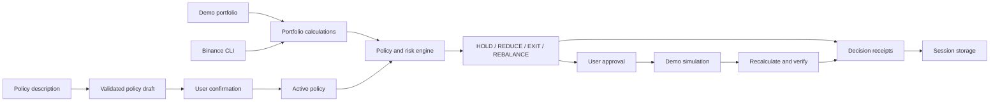

# Wardyn

**Your positions never go unwatched.**

Wardyn is a policy-based position manager for existing cryptocurrency spot holdings. It monitors portfolio allocation, stablecoin reserves, profit targets, and drawdowns, then recommends **HOLD**, **REDUCE**, **EXIT**, or **REBALANCE** actions with an explanation of the rules behind each decision.

You define the policy and approve interventions. Wardyn calculates the proposed adjustment and preserves the evidence in a downloadable receipt. It manages positions you already own; it does not discover tokens or select trade entries.

Wardyn starts with simulated funds. Binance account access is read-only, and all action execution is limited to the demo portfolio.


## Features

- **Portfolio overview:** balances, allocations, stable reserves, available unrealized profit and loss, and a transparent risk breakdown.
- **Personal policies:** describe your preferences in natural language, review the resulting controls, and activate them explicitly.
- **Position decisions:** evaluate concentration, profit-taking, tracked-peak drawdown, reserve requirements, action-size limits, and cooldowns.
- **Wardyn Watch:** run manual scans or monitor every 30 seconds while the workspace tab is open and visible.
- **Approval workflow:** review proposed sales before confirming a simulation.
- **Decision receipts:** inspect the original portfolio, triggering rules, proposed trade, resulting portfolio, and verification status; export receipts as JSON.
- **Binance data:** read supported account balances through the official Binance CLI or view public market data separately.

## Getting started

Requires **Node.js 22.13+** and **pnpm 11**.

```sh
git clone https://github.com/0xnald/wardyn.git
cd wardyn
pnpm install --frozen-lockfile
pnpm dev
```

Open [http://127.0.0.1:3000](http://127.0.0.1:3000). No credentials or funds are required for demo mode.

To run the production server:

```sh
pnpm build
pnpm start
```

Both servers use port 3000 by default, so stop the development server before starting the production server.

## Using Wardyn

1. Open **Your policy** and describe how you want your positions managed.
2. Interpret the description, review all policy fields, and select **Activate policy**.
3. Open **Overview** to inspect positions or run a scenario.
4. Select **Review decision** when an intervention is proposed.
5. Review the evidence and expected effect, then approve the simulation or reject it.
6. Open **Receipts** to inspect the outcome or download its JSON record.

A pending proposal prevents overlapping interventions. Proposals expire after two minutes; scan again to obtain a fresh proposal. Changing the policy invalidates existing proposals.

### Policy controls

| Control                  | Default    | Purpose                                                              |
| ------------------------ | ---------- | -------------------------------------------------------------------- |
| Maximum asset allocation | 30%        | Limit exposure to one non-stable asset.                              |
| Minimum stable reserve   | 15%        | Maintain a USDT portfolio buffer.                                    |
| Profit threshold         | 50%        | Identify positions eligible for gradual profit-taking.               |
| Profit scale-out         | 10%        | Set the portion to sell when the profit threshold is reached.        |
| Peak drawdown limit      | 18%        | Trigger loss protection using an available tracked peak.             |
| Cooldown                 | 60 minutes | Prevent repeated interventions after a simulated or rejected action. |
| Maximum action size      | 100%       | Cap the portion of a position that one action can sell.              |

Loss protection and overtrading protection are enabled by default. The maximum action size is a ceiling, not a target. Risk profile labels describe the mandate; the numeric controls determine the rules.

### Decisions

| Decision  | Meaning                                                                                                                                                                             |
| --------- | ----------------------------------------------------------------------------------------------------------------------------------------------------------------------------------- |
| HOLD      | Retain the position when no intervention is required or an execution guard prevents another proposal. Missing history is disclosed when some protection checks cannot be evaluated. |
| REDUCE    | Sell part of a position to address concentration, take gradual profits, or apply loss protection.                                                                                   |
| EXIT      | Close a position after severe deterioration, subject to the maximum action-size limit.                                                                                              |
| REBALANCE | Reduce exposure to restore the stablecoin reserve.                                                                                                                                  |

Risk scores and decision confidence reflect deterministic rules, not probabilities of profit. Unknown entry prices and historical peaks remain unknown rather than being estimated silently.

### Demo scenarios

The demo contains synthetic BTC, BNB, SOL, and USDT holdings valued at 10,000 USDT. Scenarios use the same portfolio and policy engines as account data.

| Scenario             | Behavior under the default policy                                                                                      |
| -------------------- | ---------------------------------------------------------------------------------------------------------------------- |
| Quiet market         | HOLD while positions remain within their rules.                                                                        |
| SOL concentration    | Propose a 2.5 SOL sale at 200 USDT; after approval, SOL allocation moves from 34% to 29% and reserves from 13% to 18%. |
| Market pullback      | HOLD during a broad decline with drawdowns below the loss threshold.                                                   |
| Severe deterioration | Propose EXIT for SOL after a 36% tracked-peak drawdown.                                                                |
| Reserve shortfall    | Propose REBALANCE to raise stable reserves from 10% to 15%.                                                            |

Selecting a scenario resets the synthetic portfolio and retains receipt history. Prices remain unchanged until another scenario is selected. Simulations exclude fees, spread, and slippage.

## Natural-language policies

With AI credentials configured, Wardyn uses the Anthropic Messages API and a structured schema to translate a description into an editable policy. Zod validates the response, and the policy becomes active only after your confirmation.

Without credentials, or when the AI service fails, a limited rule-based parser produces a clearly labelled draft. Review every field, including defaults for preferences that were not specified or could not be interpreted.

The language model interprets policy intent. Portfolio calculations, trade sizing, rule enforcement, and decision explanations are handled by the deterministic engine.

## Binance integration

Wardyn's account adapter uses the official Binance CLI associated with Binance Skills Hub. It runs fixed commands without a shell and validates responses before calculating portfolio values.

| Capability             | Interface                                  | Availability                                                      |
| ---------------------- | ------------------------------------------ | ----------------------------------------------------------------- |
| Spot balances          | `binance-cli spot get-account`             | Requires an installed CLI and authorized read access.             |
| Market evidence        | `spot ticker24hr` and `spot klines`        | Used by the account adapter for supported assets.                 |
| Public market preview  | `/api/v3/ticker/24hr` and `/api/v3/klines` | Separate read-only preview; does not connect an account.          |
| MCP discovery          | `node scripts/discover-binance.mjs`        | Lists tool schemas when the documented MCP endpoint is reachable. |
| MCP account connection | —                                          | Not supported.                                                    |
| Live order execution   | —                                          | Not supported.                                                    |

The account adapter is experimental and has not been validated with an authenticated account. It reports missing credentials, unavailable commands, and unsupported data as errors; it does not replace failed account reads with demo balances.

Supported assets are **BTC, BNB, SOL, and USDT**. Nonzero unsupported account balances cause the import to fail to avoid understating portfolio exposure. Valuation includes free and locked balances. Account balances do not provide entry prices or tracked position peaks, so related protection checks may be unavailable.

See the [Binance CLI setup](https://github.com/binance/binance-cli), [Skills Hub spot command reference](https://github.com/binance/binance-skills-hub/blob/main/skills/binance/binance/references/spot.md), and [Binance MCP documentation](https://developers.binance.com/en/docs/agent-native/mcp-server/agentic).

## Configuration

Copy `.env.example` to `.env.local` to enable optional integrations. Restart the server after changing configuration. Keep credentials server-side and out of version control.

| Variable                      | Purpose                                                                       |
| ----------------------------- | ----------------------------------------------------------------------------- |
| `WARDYN_AI_API_KEY`           | Anthropic API key for policy interpretation.                                  |
| `WARDYN_AI_MODEL`             | Model ID available to your Anthropic account; both AI variables are required. |
| `WARDYN_BINANCE_READ_ENABLED` | Set to `true` after installing and authorizing the official CLI.              |
| `WARDYN_BINANCE_CLI_PATH`     | Optional CLI executable path; otherwise uses `binance-cli` on PATH.           |
| `BINANCE_API_KEY`             | CLI account credential; a configured CLI profile is also supported.           |
| `BINANCE_SECRET_KEY`          | CLI secret.                                                                   |
| `BINANCE_API_ENV`             | CLI environment: `prod`, `demo`, or `testnet`.                                |

Enable only read permissions for account access. The account connection is restricted to loopback requests and intended for a private local installation.

## Architecture

Wardyn uses Next.js, React, TypeScript, Zod, and decimal.js. A Node server owns integrations, portfolio calculations, workflow state, and persistence. The browser displays the workspace and submits user actions.

**Observe → Analyze → Decide → Approve → Simulate → Verify → Receipt**



Monetary calculations use decimal arithmetic, and values cross application boundaries as decimal strings. Quotes older than two minutes or unexpectedly in the future are rejected. Simulated actions validate the original portfolio and cannot be executed twice.

### Storage and monitoring

An opaque HTTP-only, same-site session cookie identifies each browser workspace. State is stored in `.wardyn/` through serialized updates and atomic file replacement. Use persistent storage to retain sessions across server restarts.

Wardyn runs as a single Node process. Each session retains up to 200 receipts and 100 monitoring runs. Export receipts you want to keep beyond that limit.

Watch scans every 30 seconds while the tab is open and visible. Closing or hiding the tab stops scheduled scans. It is not an unattended monitoring service.

### Source layout

```text
src/domain/       Portfolio, policy, risk, decisions, simulation, receipts
src/lib/binance/  CLI and public market adapters
src/lib/ai/       Policy interpretation and rule-based fallback
src/features/    Demo scenarios
src/server/      Monitoring, persistence, workflow, request security
src/components/  Interface and browser workspace state
src/app/         Pages and API route
```

## Development

```sh
pnpm build
pnpm typecheck
pnpm lint
pnpm test
pnpm format:check
```

Run the initial build to generate Next.js route declarations before type-checking a fresh checkout. Tests cover portfolio arithmetic, policy decisions, trade limits, approval expiry, persistence, response validation, and request-origin checks.

## Limitations

- Action execution is simulated; Wardyn does not place exchange orders.
- Live account access supports only the listed spot assets and requires a local CLI installation.
- Missing entry prices or tracked peaks limit profit and drawdown evaluation.
- USDT is the valuation unit; displayed values do not assume a guaranteed US dollar peg.
- The application is intended for a private, single-process installation with persistent storage, not a public multi-user service with shared credentials.
- Withdrawals, transfers, futures, token discovery, and autonomous live trading are outside the application's scope.
