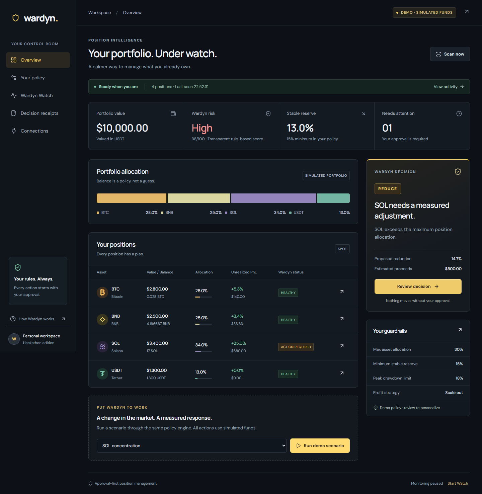
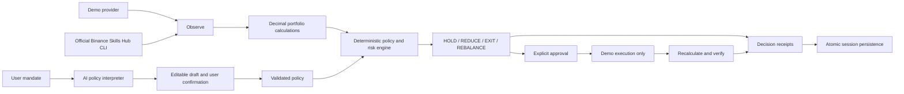

# Wardyn

**Your positions never go unwatched.**

Built for Binance Agent OS Mini Hackathon — Track A.

Most trading agents help you enter trades. Wardyn manages what happens after you enter.

Wardyn watches existing positions, evaluates a user-confirmed policy, and produces explainable **HOLD**, **REDUCE**, **EXIT**, or **REBALANCE** decisions. Every intervention has evidence, explicit approval, verification, and a durable decision receipt.

## For judges

**Track A · Post-entry portfolio management · Working local demo with simulated funds.**

Wardyn is designed for spot holders who want their existing positions managed according to a reviewed mandate. Its central demonstration is a complete, inspectable decision cycle: a concentration breach leads to a sized proposal, user approval, portfolio recalculation, and a receipt showing the result.

| Review question                       | Where to look                                                                                                   |
| ------------------------------------- | --------------------------------------------------------------------------------------------------------------- |
| Can I run it without credentials?     | [Local setup and walkthrough](#try-the-demo)                                                                    |
| What should each scenario do?         | [Expected demo results](#expected-demo-results)                                                                 |
| Where does AI participate?            | [Policy interpretation and fallback](#why-ai)                                                                   |
| What uses Binance infrastructure?     | [Integration status](#binance-agent-os-integration) and [official-source evidence](docs/binance-integration.md) |
| What was actually tested?             | [Verification record](docs/verification.md): 31 tests, production build, desktop and mobile browser flows       |
| How can I inspect the implementation? | [Architecture](#how-it-works) and [source map](#project-layout)                                                 |

**Submission assets:** repository, screenshots, and a [90-second recording script](docs/demo-script.md) are included. A recorded demo URL and a public hosted app URL have not yet been added. The localhost link below requires running the project on your computer.



## Try the demo

Requires **Node.js 22.13+** and **pnpm 11**.

```sh
git clone https://github.com/0xnald/wardyn.git
cd wardyn
pnpm install --frozen-lockfile
pnpm dev
```

Open [Wardyn locally](http://127.0.0.1:3000). No API keys or funds are required.

1. Launch Wardyn and open **Your policy**.
2. Keep the prefilled mandate, interpret it, inspect every field, and activate the draft. For the results below, retain the default policy values listed in the next section.
3. Run **SOL concentration** from Overview or Wardyn Watch.
4. Open **Review decision** and inspect the evidence.
5. Approve and confirm the simulation.
6. Inspect the receipt: SOL moves from **34% to 29%**, stable reserve from **13% to 18%**.
7. Try **Market pullback** for HOLD, **Severe deterioration** for EXIT, and **Reserve shortfall** for REBALANCE.

See the [90-second demo script](docs/demo-script.md).

### Expected demo results

Use a fresh browser session and the default policy: maximum allocation **30%**, minimum stable reserve **15%**, profit threshold **50%** with **10%** scale-out, peak drawdown limit **18%**, cooldown **60 minutes**, and maximum action size **100%**. Loss and overtrading protection are enabled. The maximum action size is a ceiling; the engine computes the proposed size.

| Scenario             | Expected decision | What to verify                                                                                         |
| -------------------- | ----------------- | ------------------------------------------------------------------------------------------------------ |
| Quiet market         | HOLD              | No trade proposed when the management rules are satisfied.                                             |
| SOL concentration    | REDUCE SOL        | Approve a 2.5 SOL simulated sale at 200 USDT: SOL allocation moves 34% → 29%, reserve 13% → 18%.       |
| Market pullback      | HOLD              | Broad negative movement alone does not trigger a sale; tracked drawdowns stay below 18%.               |
| Severe deterioration | EXIT SOL          | The 36% tracked-peak drawdown exceeds the severe-loss threshold; default settings propose closing SOL. |
| Reserve shortfall    | REBALANCE         | A simulated sale restores the reserve from 10% to 15%.                                                 |

Scenario selection resets the synthetic portfolio while retaining receipt history. A new scan uses the current scenario prices. Complete approvals within two minutes; after expiry, scan again for a fresh proposal. In **Receipts**, download the JSON to inspect the original portfolio, policy triggers, proposed trade, resulting portfolio, and verification status.

## Problem and solution

Position management requires repeated attention: allocation checks, liquidity reserves, profit-taking, loss protection, and remembering the original plan. Wardyn turns those responsibilities into a visible policy workflow instead of an open-ended trading chat.

The MVP includes:

- A portfolio dashboard and per-position evidence views.
- Natural-language policy drafts with editable controls and explicit activation.
- Concentration, stable reserve, profit scaling, drawdown, action-size, and cooldown checks.
- A transparent risk score with a factor-by-factor breakdown.
- An observable monitoring loop with scan history.
- Approval-first simulated sales, portfolio recalculation, and verification.
- Persistent, downloadable decision receipts containing original and resulting states.
- Five deterministic scenarios evaluated by the same domain engines as real data.
- Read-only Binance Skills Hub CLI and public market-data adapters.

## How it works

The application uses Next.js 16, React 19, TypeScript, Zod, decimal.js, and Vitest. The Node server owns integrations and persistence; the browser displays state and requests explicit actions. Dependency versions are pinned in `package.json` and `pnpm-lock.yaml`.

**Observe → Analyze → Decide → Act → Verify → Receipt**



## Why AI

Portfolio intent is naturally expressed in language. Wardyn optionally calls the Anthropic Messages API with a structured tool schema to translate a mandate into a bounded policy draft. Zod validates the entire response. The user must confirm the draft before it becomes active.

Without configured AI credentials, the app uses a **clearly labelled, limited rule-based parser**. Invalid responses and service failures also fall back to that parser. The UI never presents this fallback as an LLM response. Any unstated or unsupported intent requires reviewing the displayed defaults.

The LLM does not choose order quantities, override risk limits, or execute trades. Decision explanations are derived from deterministic evidence.

## Binance Agent OS integration

The implemented Agent OS route uses the **official Binance Skills Hub CLI**:

| Capability                  | Implementation                                      | Status                                                        |
| --------------------------- | --------------------------------------------------- | ------------------------------------------------------------- |
| Spot balances               | `binance-cli spot get-account`                      | Adapter implemented; requires local CLI and read permission   |
| Market evidence             | `spot ticker24hr` and `spot klines`                 | Adapter implemented; schema validated                         |
| Public market preview       | Official `/api/v3/ticker/24hr` and `/api/v3/klines` | Read-only preview, separate from portfolio                    |
| MCP discovery               | Official MCP SDK against documented endpoint        | Utility included; discovery failed in development environment |
| MCP OAuth / trading         | None                                                | Not implemented                                               |
| Live order execution        | None                                                | Not implemented                                               |
| Approval and execution demo | Internal simulation                                 | Complete; no funds move                                       |

Authenticated account reads have **not been verified end to end** in this build environment. The account adapter fails clearly if credentials, the executable, or supported data are unavailable. It does not silently substitute demo balances.

Read the [integration verification and limitations](docs/binance-integration.md), [official Skills Hub command reference](https://github.com/binance/binance-skills-hub/blob/main/skills/binance/binance/references/spot.md), and [official Binance MCP documentation](https://developers.binance.com/en/docs/agent-native/mcp-server/agentic).

## Configuration

Copy `.env.example` to `.env.local` only when enabling optional integrations. Keep all values server-side.

| Variable                      | Purpose                                                                      |
| ----------------------------- | ---------------------------------------------------------------------------- |
| `WARDYN_AI_API_KEY`           | Optional Anthropic API key for natural-language policy interpretation        |
| `WARDYN_AI_MODEL`             | Model ID available to your Anthropic account; both AI variables are required |
| `WARDYN_BINANCE_READ_ENABLED` | Set to `true` after installing and authorizing the official CLI              |
| `WARDYN_BINANCE_CLI_PATH`     | Optional path to the CLI executable; otherwise uses `binance-cli` on PATH    |
| `BINANCE_API_KEY`             | Official CLI account credential; a configured CLI profile is also supported  |
| `BINANCE_SECRET_KEY`          | Official CLI secret; never expose it to the browser                          |
| `BINANCE_API_ENV`             | Official CLI environment: `prod`, `demo`, or `testnet`; select deliberately  |

See [Anthropic tool-use documentation](https://platform.claude.com/docs/en/agents-and-tools/tool-use/overview) and [Binance CLI setup](https://github.com/binance/binance-cli). No keys are needed for demo mode.

## Verification

The [September 7 verification record](docs/verification.md) documents **31 passing tests across 14 files**, successful TypeScript and ESLint checks, a production build, and browser validation of both development and production flows. Screenshots show simulated data; they are not evidence of an authenticated Binance account connection.

```sh
pnpm typecheck
pnpm lint
pnpm test
pnpm build
pnpm start
```

For a fresh checkout, run `pnpm build` before `pnpm typecheck` so Next.js generates its route declarations. For production use, stop the development server before `pnpm start` if both use port 3000.

Tests exercise the real financial calculations and decision engines, including stale data, unknown cost basis, concentration, reserve gaps, risk, the four decisions, duplicate plans, action-size limits, approval expiry, receipt state preservation, concurrent persistence, malformed AI output, adapter schemas, and browser-origin validation.

## Persistence and monitoring

An opaque, HTTP-only, same-site session cookie isolates each browser workspace. State is stored in `.wardyn/` using serialized updates and atomic file replacement. Keep this folder on persistent storage. It is excluded from Git.

This is a **single-process Node MVP**, not a distributed service. The UI retains up to 200 receipts and 100 monitoring runs per session. Export important receipts before the retention limit is reached.

Wardyn Watch runs a scan every 30 seconds **while the workspace tab is open and visible**. Closing the tab stops scheduled monitoring. The demo keeps its current synthetic prices until a new scenario is selected. This is not an unattended protection service.

## Safety and practical limits

- Demo mode is the default; simulation always requires explicit approval.
- No live order endpoint or unrestricted command execution is exposed.
- All monetary calculations use `decimal.js`; monetary values cross boundaries as decimal strings.
- Quotes older than two minutes or unexpectedly in the future fail valuation.
- Proposals expire after two minutes and cannot be executed twice.
- Pending plans block overlapping interventions. Policy changes invalidate existing proposals.
- Risk and decision confidence are rule-based heuristics, not probabilities of return.
- Drawdown is measured from an available tracked peak; unknown peaks and cost basis remain unknown.
- Supported assets are BTC, BNB, SOL, and USDT. Nonzero unsupported live balances fail the account import rather than understate portfolio exposure.
- USDT is the valuation unit, not a guaranteed US dollar peg. Simulations exclude fees, spread, and slippage.
- Live account access is restricted to loopback requests. Run this locally for private account data. Do not expose a credential-enabled installation as a public multi-user service.
- The app has no withdrawal, transfer, futures, token-discovery, or autonomous live-trading capability.

## Project layout

```text
src/domain/       Portfolio, policy, risk, decisions, simulation, receipts
src/lib/binance/  Official CLI and public market adapters
src/lib/ai/       Structured policy interpretation and labelled fallback
src/features/    Deterministic demo scenarios
src/server/      Monitoring, persistence, workflow service, request security
src/components/  Product interface and browser workspace state
src/app/         Next.js pages and API route
docs/            Integration evidence and demonstration instructions
```

## Hackathon

**Built for Binance Agent OS Mini Hackathon — Track A.**

The core demo works without credentials. Optional live integrations must be described according to their actual verification status. This project makes no claim of prize eligibility or guaranteed financial outcomes.
